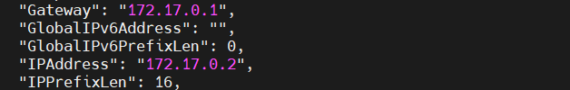

reate Docker Image

````
docker build -t mysql .
````

#### Create Container

````
docker run -itd --name mysql-db -p 3306:3306 mysql
````
#### Copy Container IP and add to context.xml file in Backend folder

````
docker inspect <containerID>
````

