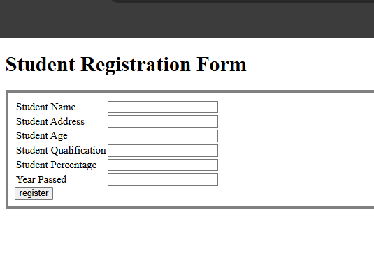
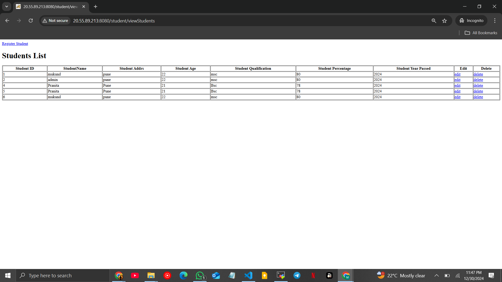

# 3-tire-docker-Azure
==========================
this is docker 3-tire architecture with Azure
### 3-tire-docker-Azure
==========================
## Step1 : log in to the Azure portal


## step 2: create resource vm 


## step 3: configure vm machine and create 


## step 4 : get ssh through public ip address 


## step 5 : connect in ssh client 


## step 6 : run the following command 
```
sudo apt update -y 

sudo git clone <git https url>

```
## step 7 : run the command in the specific repository to build the container and run the application 






